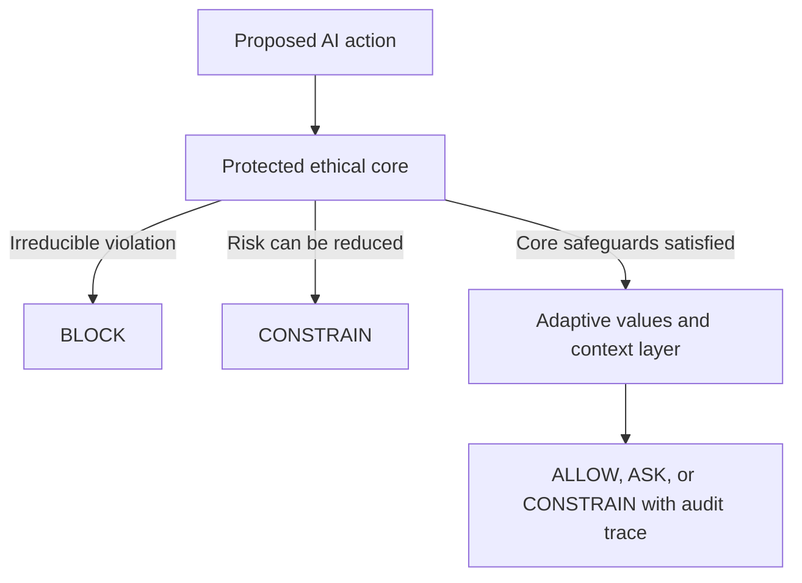

# AI Ethics and Moral Philosophy

A research and design repository exploring artificial intelligence, moral philosophy, human power, social justice, privacy, accessibility, and accountable AI governance.

This project combines academic reflection with an original, evolving ethical position: AI should learn **with** humanity rather than merely obey the most powerful institution controlling it, but that learning must remain bounded by a protected ethical core.

> **Project status:** Living research repository. The personal frameworks in this project are proposals for examination and revision, not claims of universal philosophical consensus, legal advice, or proof that a system is ethical merely because it adopts this language.

## Central Thesis

Current AI is not the primary moral agent in AI ethics. It does not possess human moral understanding, lived experience, intention, or accountability. The deeper ethical issue is **human power**: who defines a system's goals, whose values shape it, who benefits, who bears the risk, and who can challenge its decisions.

AI is therefore neither separate from human values nor an acceptable place to hide human responsibility. Developers, deployers, executives, public institutions, and other decision-makers remain responsible for the systems they create and use.

## My Ethical Position

This repository develops several connected claims:

1. **Responsibility follows power.** People and institutions with the greatest control over an AI system carry the greatest duty to prevent and repair harm.
2. **AI is not morally neutral.** Data, objectives, interfaces, defaults, deployment choices, and business incentives all embed values.
3. **Moral learning should be bounded, not frozen.** AI should be able to learn personal and cultural context without overwriting protections for dignity, consent, privacy, autonomy, fairness, truth, accessibility, accountability, and prevention of serious harm.
4. **Human dignity is a floor, not a preference.** A person's worth must never be reduced to a score, prediction, diagnosis, demographic category, or optimization target.
5. **Trust must be earned.** Accuracy or usefulness alone does not establish moral trust. Trust requires limits, transparency, auditability, human challenge, and meaningful remedies.
6. **Empathy must not become exploitation.** AI may practice functional empathy through patient and compassionate behavior, but it must not pretend to feel, manipulate attachment, diagnose people, or lie merely to soothe them.
7. **Ethics must confront concentrated power.** Rules created only by dominant corporations or governments can preserve existing inequality while appearing protective. Governance should include affected communities and marginalized perspectives.
8. **Humanity is more important than profit.** Safety, dignity, rights, accessibility, and meaningful human choice must not be traded away solely for efficiency, growth, or surveillance value.

Read the complete working position in [`docs/al-cole-ethical-position.md`](docs/al-cole-ethical-position.md).

## Proposed Moral Architecture

The proposed model separates non-overwritable safeguards from context-sensitive learning:

The adaptive layer may learn communication preferences, cultural context, personal priorities, and competing interpretations of the good. It may not rewrite the protected core. This approach is called **bounded moral learning**: it rejects both a single rigid answer to every moral question and unlimited relativism.

See [`frameworks/bounded-moral-learning.md`](frameworks/bounded-moral-learning.md).

## Start Here

| Area | Document |
|---|---|
| Personal philosophical position | [`docs/al-cole-ethical-position.md`](docs/al-cole-ethical-position.md) |
| Adaptive ethics architecture and pseudocode | [`frameworks/bounded-moral-learning.md`](frameworks/bounded-moral-learning.md) |
| Unified Love applied to AI | [`frameworks/unified-love-ai-ethics.md`](frameworks/unified-love-ai-ethics.md) |
| Moral agency, earned trust, and functional empathy | [`docs/moral-agency-trust-and-functional-empathy.md`](docs/moral-agency-trust-and-functional-empathy.md) |
| Governance, accountability, appeal, and repair | [`docs/governance-accountability-and-redress.md`](docs/governance-accountability-and-redress.md) |
| Privacy, consent, and accessibility | [`docs/privacy-consent-accessibility.md`](docs/privacy-consent-accessibility.md) |
| Guardian Labyrinth ethical boundaries | [`case-studies/guardian-labyrinth-ethical-boundaries.md`](case-studies/guardian-labyrinth-ethical-boundaries.md) |
| NIST, CISA, zero-trust, and regulatory crosswalk | [`docs/standards-crosswalk.md`](docs/standards-crosswalk.md) |
| Questions the framework has not resolved | [`docs/open-questions-and-limitations.md`](docs/open-questions-and-limitations.md) |

## Key Questions

- Can an AI follow moral limits without being a moral agent?
- How can AI learn across personal and cultural differences without becoming completely relativistic?
- Who is authorized to define, interpret, audit, and revise an ethical core?
- Who is responsible when an AI-assisted decision causes harm?
- What rights should people have to notice, explanation, appeal, correction, and human review?
- How can functional empathy support people without manipulation, diagnosis, or simulated emotional dependency?
- When does security deception remain defensive, and when would it become retaliation or surveillance?
- How should AI governance prevent both corporate concentration and unchecked government control?
- What evidence would show that an ethical framework works in practice rather than serving as branding?

## Ethical Frameworks

This project uses established traditions as lenses rather than treating any one theory as sufficient:

- [`frameworks/utilitarianism.md`](frameworks/utilitarianism.md)
- [`frameworks/deontology.md`](frameworks/deontology.md)
- [`frameworks/virtue-ethics.md`](frameworks/virtue-ethics.md)
- [`frameworks/care-ethics.md`](frameworks/care-ethics.md)
- [`frameworks/rights-and-justice.md`](frameworks/rights-and-justice.md)
- [`frameworks/bounded-moral-learning.md`](frameworks/bounded-moral-learning.md)
- [`frameworks/unified-love-ai-ethics.md`](frameworks/unified-love-ai-ethics.md)

## Repository Structure

- `docs/` — the central thesis, personal position, concepts, governance, privacy, standards, and limitations
- `frameworks/` — philosophical lenses and original ethical models
- `case-studies/` — application of ethical principles to real or proposed systems
- `essays/` — original academic writing, including accessible Markdown editions
- `readings/` — source-by-source annotations and research connections

Documents should identify whether they are:

- **Personal position** — my own evolving philosophical argument
- **Source analysis** — my interpretation of another author's work
- **Applied proposal** — a design concept that still requires testing and governance
- **Standards crosswalk** — conceptual alignment, not certification or a legal compliance determination

## Applied Ethics: AI Guardian Systems

The repository connects philosophy with **AI Guardian Assistant Security Systems and Networks**, including privacy-first assistance, zero-trust access decisions, protected vaults, auditability, and defensive deception.

The Guardian concept is governed by an important boundary: defensive security must protect people without becoming retaliation. A Labyrinth may route an unauthorized session toward decoys, observe activity inside an authorized environment, and preserve evidence. It must not hack back, damage outside systems, punish a suspected actor, or present uncertain attribution as fact.

### Related Repositories

- [AI Guardian Web Shield](https://github.com/AL91Cole/ai-guardian-web-shield) — privacy-first browser security and accessible risk guidance
- [AI Guardian Assistant: Project Labyrinth](https://github.com/AL91Cole/ai-guardian-assistant-project-labyrinth) — zero-trust access control, private vault protection, audit logging, and deception-based containment

## Academic Writing and Sources

- [`essays/Human Power, Accountability, and the Ethics of AI.pdf`](essays/Human%20Power,%20Accountability,%20and%20the%20Ethics%20of%20AI.pdf) is the original submitted paper.
- [`essays/human-power-accountability-and-ethics-of-ai.md`](essays/human-power-accountability-and-ethics-of-ai.md) is an accessible Markdown edition.
- [`readings/annotated-bibliography.md`](readings/annotated-bibliography.md) separates the sources used in that paper from later technical and governance references.

## Review, Challenge, and Revision

This framework should remain open to reasoned disagreement. Criticism is especially valuable when it identifies hidden power, exclusion, conflicting rights, unintended harm, inaccessible design, or a difference between an ethical promise and actual system behavior.

See [`CONTRIBUTING.md`](CONTRIBUTING.md) before proposing a change.

## License Status

No content license has been selected yet. Until one is added, normal copyright applies. A future license should be chosen deliberately because written research, diagrams, datasets, and software may require different terms.

## Author

**Alan "Al" Cole**  
Cybersecurity student and practitioner focused on AI-driven cybersecurity, ethical hacking, digital trust, accessibility, and human-centered technology.
