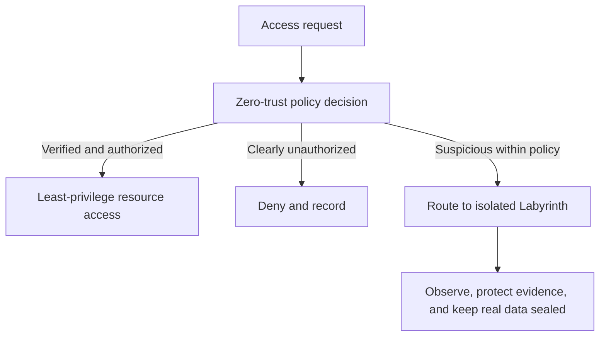

# Case Study: Ethical Boundaries for the AI Guardian Labyrinth

**Document type:** Applied defensive-security proposal  
**Status:** Conceptual design; not legal authorization or a production-security claim

## Purpose

The AI Guardian Labyrinth is a proposed defensive deception layer for systems that the defender is authorized to protect. When zero-trust evaluation identifies an unauthorized or highly suspicious session, the architecture can deny access or route the session into a controlled environment containing decoy systems, honeytokens, and non-sensitive synthetic data.

The goal is to protect real people and resources, observe tactics safely, and preserve evidence. The goal is not to punish an intruder.

## Conceptual Flow

## Non-Negotiable Boundaries

The Labyrinth must:

- operate only within systems and environments the defender is authorized to control;
- keep real private vaults and production data isolated from the deception environment;
- use synthetic, non-sensitive decoy information;
- record only information necessary for defense, investigation, and system improvement;
- preserve uncertainty and distinguish evidence from inference;
- allow the unauthorized actor to disengage simply by ending the session;
- stop observation when the session leaves the authorized environment;
- support human review, safe shutdown, and audit.

The Labyrinth must never:

- hack back or access the actor's outside device or network without separate legal authority;
- destroy, remove, encrypt, disable, or alter outside data or systems;
- retaliate, threaten, humiliate, or punish;
- deliberately cause physical, financial, or psychological injury;
- deploy real personal, medical, identity, or confidential data as bait;
- fabricate evidence or alter logs to strengthen a case;
- claim a person's identity or location as certain from weak indicators;
- monetize captured information;
- continue tracking a person after they leave the protected environment.

## Containment, Not Imprisonment

The term "trap" refers to routing and retaining an unauthorized session inside a defender-controlled decoy environment while that session remains voluntarily engaged. It must not mean preventing a person from disconnecting, damaging their equipment, or pursuing them beyond the protected system.

The safest ethical interpretation is: **the maze persists for the session, but the actor can always leave by ending the interaction.**

## Defensive Deception and Entrapment

Defensive deception generally presents opportunities or false targets inside an authorized environment; it should not pressure an otherwise unwilling person to commit an offense. Ethical design should avoid inducements that escalate conduct merely to produce a more serious case.

Whether a particular deployment raises entrapment, wiretap, computer-misuse, privacy, employment-monitoring, or evidence-admissibility issues depends on jurisdiction and facts. A technical design cannot answer that legal question by itself. Deployment requires counsel familiar with the relevant environment.

## Attribution Without Overclaiming

Each attribution statement should include an evidence level:

| Level | Permitted statement |
|---|---|
| Observation | "This session performed these recorded actions at these times." |
| Technical correlation | "These indicators overlap with other activity." |
| Investigative lead | "This evidence may support further authorized investigation." |
| Corroborated assessment | "Multiple independent sources support this assessment with stated confidence." |
| Legal identity finding | Reserved for competent authorities and due process; not declared by the AI alone |

IP addresses, language, time zones, device traits, tactics, and geolocation signals can be spoofed or shared. The system should generate confidence-qualified leads, not promises that it can "pinpoint" a person.

## Evidence Preservation

Evidence handling should include:

- synchronized and documented time sources;
- cryptographic hashing and trusted timestamps;
- append-only or tamper-evident logs;
- separation of original records from analyst notes and AI summaries;
- provenance for each event and transformation;
- least-privilege access and separation of duties;
- documented retention and deletion schedules;
- export in a reviewable format;
- a human-readable brief that links each conclusion to supporting records;
- explicit labels for fact, model inference, analyst interpretation, and unknowns.

AI-generated summaries must never replace the original evidence.

## External Reporting and Civil Liberties

Evidence should not be sent automatically to law enforcement merely because the system labeled a session suspicious. A defensible workflow should:

1. protect and timestamp the original records automatically;
2. produce a review brief without overstating identity or intent;
3. apply documented severity, confidence, and legal thresholds;
4. use qualified human review;
5. include pre-vetted privacy, legal, or civil-liberties counsel for ambiguous or high-impact cases;
6. minimize information before any disclosure;
7. disclose only to an authorized recipient for a defined purpose;
8. retain an audit trail of the decision and disclosure.

For a design using automatic legal escrow, the recipient, trigger, confidentiality, user notice, retention, conflicts of interest, and withdrawal process must be defined before deployment. Automatic transfer can itself create privacy risk and should not be assumed ethical without review.

## Government and Critical-Infrastructure Use

Use by government or critical infrastructure creates higher stakes, not weaker ethical duties. Additional safeguards should include:

- formal authorization and a narrowly defined defensive mission;
- separation from intelligence collection unrelated to the protected system;
- independent oversight and periodic civil-liberties review;
- rules for public records, classified data, and evidence sharing;
- controls against political, religious, journalistic, labor, or protest surveillance;
- testing that deception cannot affect safety-critical operations;
- continuity and manual fallback plans;
- stricter approval for any cross-agency correlation;
- public transparency appropriate to operational security;
- meaningful remedies for an innocent person wrongly implicated.

## Fail-Closed and Safe Shutdown

When policy integrity, identity controls, logging, or vault separation cannot be verified, access to protected resources should fail closed. The system should not silently route real users into punitive or endless loops.

A safe shutdown should:

- seal protected data;
- stop new high-risk automated decisions;
- preserve existing evidence without modifying it;
- alert authorized responders;
- provide a tested human continuity process;
- avoid destroying keys or records needed for safety, recovery, or due process unless a documented crypto-shredding policy specifically requires it.

## Ethical Success Criteria

The Labyrinth is ethically defensible only if evidence shows that it:

- reduces exposure of real systems and personal information;
- does not cause harm outside the protected environment;
- resists unauthorized administrator use;
- maintains reliable evidence provenance;
- controls false positives and permits correction;
- prevents uncertain attribution from becoming an accusation;
- applies retention and disclosure limits consistently;
- can be independently audited and stopped.

A powerful defensive system needs stronger restraint precisely because it is powerful.
